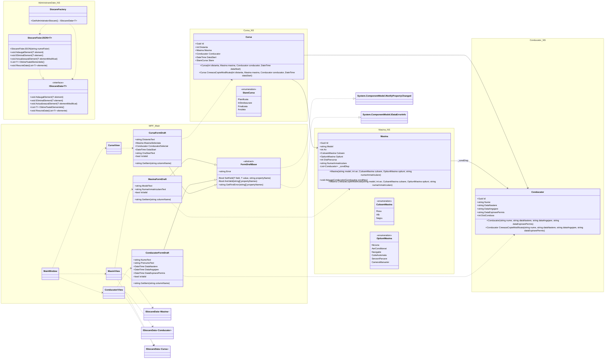

```mermaid
classDiagram
direction LR

namespace Masina_NS {
  class Masina {
    +Guid Id
    +string Model
    +int An
    +CuloareMasina Culoare
    +OptiuniMasina Optiuni
    +int DistParcursa
    +string NumarInmatriculare
    -List~Conducator~ _condDisp
    +Masina(string model, int an, CuloareMasina culoare, OptiuniMasina optiuni, string numarInmatriculare)
    +void AdaugaConducator(Conducator condNou)
    +Masina CreeazaCopieModificata(string model, int an, CuloareMasina culoare, OptiuniMasina optiuni, string numarInmatriculare)
  }

  class CuloareMasina {
    <<enumeration>>
    Rosu
    Alb
    Negru
  }

  class OptiuniMasina {
    <<enumeration>>
    Niciuna
    AerConditionat
    Navigatie
    CutieAutomata
    SenzoriParcare
    CameraMarsarier
  }
}

namespace Conducator_NS {
  class Conducator {
    +Guid Id
    +string Nume
    +string DataNastere
    +string DataAngajare
    +string DataExpirarePermis
    +int DistCondusa
    +Conducator(string nume, string dataNastere, string dataAngajare, string dataExpirarePermis)
    +Conducator CreeazaCopieModificata(string nume, string dataNastere, string dataAngajare, string dataExpirarePermis)
  }
}

namespace Cursa_NS {
  class Cursa {
    +Guid Id
    +int Distanta
    +Masina Masina
    +Conducator Conducator
    +DateTime DataStart
    +StareCursa Stare
    +Cursa(int distanta, Masina masina, Conducator conducator, DateTime dataStart)
    +Cursa CreeazaCopieModificata(int distanta, Masina masina, Conducator conducator, DateTime dataStart)
  }

  class StareCursa {
    <<enumeration>>
    Planificata
    InDesfasurare
    Finalizata
    Anulata
  }
}

namespace AdministrareDate_NS {
  class IStocareData~T~ {
    <<interface>>
    +void AdaugaElement(T element)
    +void EliminaElement(T element)
    +void ActualizeazaElement(T elementModificat)
    +List~T~ ObtineToateElementele()
    +void RescrieDate(List~T~ elemente)
  }

  class StocareFactory {
    +GetAdministratorStocare() IStocareData~T~
  }

  class StocareFisierJSON~T~ {
    +StocareFisierJSON(string numeFisier)
    +void AdaugaElement(T element)
    +void EliminaElement(T element)
    +void ActualizeazaElement(T elementModificat)
    +List~T~ ObtineToateElementele()
    +void RescrieDate(List~T~ elemente)
  }
}

namespace WPF_Main {
  class FormDraftBase {
    <<abstract>>
    +string Error
    #bool SetField(T field, T value, string propertyName)
    #bool AreValid(string[] propertyNames)
    +string GetFirstError(string[] propertyNames)
  }

  class MasinaFormDraft {
    +string ModelText
    +string NumarInmatriculareText
    +string GetItem(string columnName)
    +bool IsValid
  }

  class ConducatorFormDraft {
    +string NumeText
    +string PrenumeText
    +DateTime DataNastere
    +DateTime DataAngajare
    +DateTime DataExpirarePermis
    +string GetItem(string columnName)
    +bool IsValid
  }

  class CursaFormDraft {
    +string DistantaText
    +Masina MasinaSelectata
    +Conducator ConducatorSelectat
    +DateTime DataStart
    +string OraStartText
    +string GetItem(string columnName)
    +bool IsValid
  }

  class MainWindow
  class MasiniView
  class ConducatoriView
  class CurseView
}

%% --- Interfaces & Aliases ---
class INotifyPropertyChanged["System.ComponentModel.INotifyPropertyChanged"]
class IDataErrorInfo["System.ComponentModel.IDataErrorInfo"]
class IStocareData_Masina["IStocareData~Masina~"]
class IStocareData_Conducator["IStocareData~Conducator~"]
class IStocareData_Cursa["IStocareData~Cursa~"]

%% --- Relationships ---
FormDraftBase ..|> INotifyPropertyChanged
FormDraftBase ..|> IDataErrorInfo

MasinaFormDraft --|> FormDraftBase
ConducatorFormDraft --|> FormDraftBase
CursaFormDraft --|> FormDraftBase

StocareFisierJSON~T~ ..|> IStocareData~T~
StocareFactory ..> IStocareData~T~
StocareFactory ..> StocareFisierJSON~T~

Cursa --> Masina
Cursa --> Conducator

Masina --> Conducator : _condDisp

MasinaFormDraft ..> Masina
ConducatorFormDraft ..> Conducator
CursaFormDraft ..> Cursa

MainWindow ..> MasiniView
MainWindow ..> ConducatoriView
MainWindow ..> CurseView

MasiniView ..> MasinaFormDraft
MasiniView ..> IStocareData_Masina
MasiniView ..> IStocareData_Cursa

ConducatoriView ..> ConducatorFormDraft
ConducatoriView ..> IStocareData_Conducator
ConducatoriView ..> IStocareData_Cursa

CurseView ..> CursaFormDraft
```